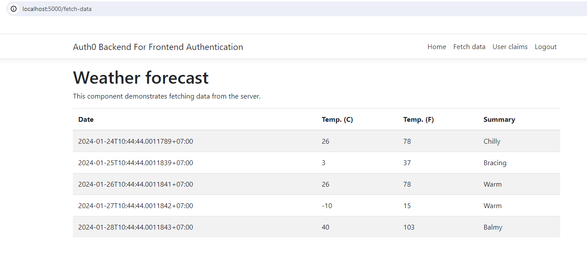

# Backend for Frontend with Auth0
This repository contains a React SPA supported by an ASP.NET Core backend to implement authentication and authorization with [Auth0](https://auth0.com/) through the Backend For Frontend (BFF) pattern.

## Requirements:

- [.NET Core 8.0](https://dotnet.microsoft.com/download/dotnet-core/5.0) installed on your machine.
- An [Auth0](https://auth0.com/) account.
    + Create a Regular Application

## To run this application:
1. Move to the `Api` folder.
2. Add the Auth0 domain and audience for your API to the `appsettings.json` configuration file, type `dotnet run` in a terminal window to launch the API.
3. Move to the `BFF` folder.
4. Add the Auth0 credentials for your Regular Web Application to the `appsettings.json` configuration file
5. While in the `BFF` folder, type `dotnet run` in a terminal window to launch the web application.
6. Point your browser to `https://localhost:5001` to interactively test your application.

## Result
+ 
## Issues:
1. System.Net.Http.HttpRequestException: The SSL connection could not be established, see inner exception.

## References:
+ [Backend For Frontend Authentication Pattern with Auth0 and ASP.NET Core](https://auth0.com/blog/backend-for-frontend-pattern-with-auth0-and-dotnet/)